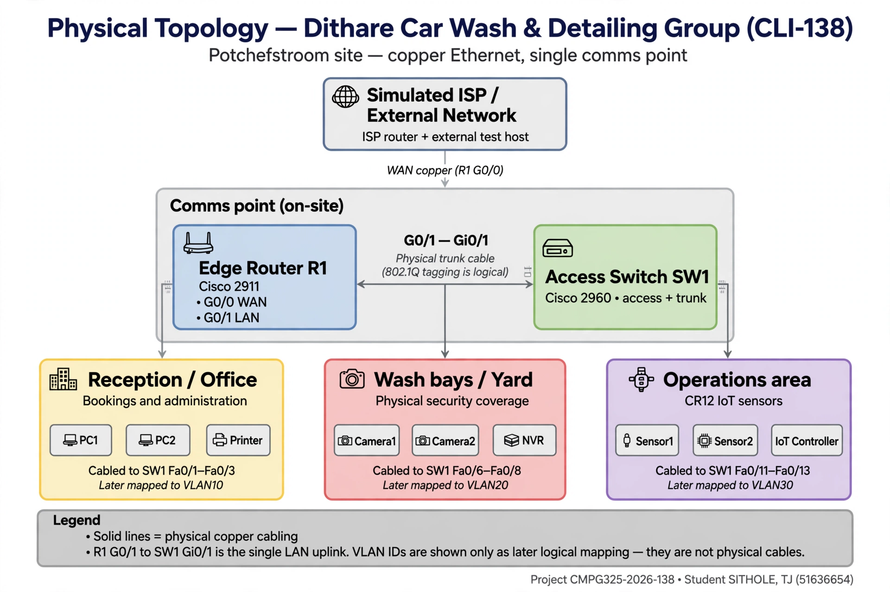

# Physical Topology

**Project ID:** CMPG325-2026-138  
**Client ID:** CLI-138  
**Student:** SITHOLE, TJ (51636654)  
**Organisation:** Dithare Car Wash & Detailing Group  
**Location:** Potchefstroom  
**Industry:** Automotive  
**Addressing Block:** `192.168.59.0/24`

---

## 1. Purpose

This document describes the physical topology for the Dithare Car Wash & Detailing Group network.

It shows the physical devices and connections that form the foundation for the logical topology, IP addressing plan, and Cisco Packet Tracer implementation.

The design uses a single edge router and a single access switch to provide connectivity for three traffic segments:

- Office Data (VLAN 10)
- CCTV (VLAN 20)
- IoT / Operations (VLAN 30 – CR12)

This document describes physical cabling only. VLAN IDs are shown only as the later logical mapping.

---

## 2. Physical Network Structure

The physical network is a **single-site** design for the Potchefstroom premises:

1. Simulated ISP / External Network (Packet Tracer only – required to demonstrate NAT)
2. Small on-site comms point with edge router **R1** and access switch **SW1**
3. **Reception / Office** – staff PCs and printer (bookings and administration)
4. **Wash bays / Yard** – CCTV cameras and NVR (site security)
5. **Operations area** – IoT sensors and controller (CR12)

All internal copper runs terminate on SW1. R1 is the only Layer 3 device and the NAT boundary.

This is a centralised router-and-switch layout appropriate for one small automotive site.

### 2.1 Physical Devices

| Device | Quantity | Model / Type | Purpose |
|---|---|---|---|
| Cisco 2911 Router | 1 | 2911 | Edge routing, inter-VLAN routing and NAT/PAT |
| Cisco 2960 Switch | 1 | 2960 | VLAN connectivity and 802.1Q trunk to router |
| Office PCs | 2 | Generic PC | Represent office users – VLAN 10 |
| Printer | 1 | Network Printer | Office peripheral – VLAN 10 |
| CCTV Cameras | 2 | Generic IP Camera | Physical security – VLAN 20 |
| NVR | 1 | Server-PT | CCTV recording – VLAN 20 |
| IoT Sensors | 2 | IoT-PT | Operational sensors – VLAN 30 |
| IoT Controller | 1 | IoT Server / SBC | IoT management – VLAN 30 |
| ISP Router | 1 | 2911 / Generic | Simulated external network for NAT testing |
| External Test Host | 1 | Server / PC | Destination for external connectivity – to be finalised in Milestone 2 |

**Total:** 13 devices (representative quantities – brief does not specify exact counts)

---

## 3. Physical Connections

| From | Interface / Port | To | Connection Type | Purpose |
|---|---|---|---|---|
| Simulated ISP | WAN link – 203.0.113.0/30 | R1 G0/0 | Copper Straight-Through | Outside / NAT boundary – ISP .1 to R1 .2 |
| R1 | G0/1 | SW1 Gi0/1 | 802.1Q Trunk – Copper | Carries VLANs 10, 20, 30 |
| SW1 | Fa0/1 – Fa0/5 (Access) | Office devices | Access – Copper | VLAN 10 connectivity – see §4.1 |
| SW1 | Fa0/6 – Fa0/10 (Access) | CCTV devices | Access – Copper | VLAN 20 connectivity – see §4.2 |
| SW1 | Fa0/11 – Fa0/15 (Access) | IoT devices | Access – Copper | VLAN 30 connectivity – see §4.3 |

> Exact switch port numbers are standardised as Fa0/1-5, Fa0/6-10, Fa0/11-15. Final .pkt file must match this allocation.

---

## 4. Internal Device Groups and Port Allocation

Standardised port allocation (consistent with IP plan):

- Office: **Fa0/1 – Fa0/5 → VLAN 10**
- CCTV: **Fa0/6 – Fa0/10 → VLAN 20**
- IoT / Operations: **Fa0/11 – Fa0/15 → VLAN 30**

### 4.1 Office Data — VLAN 10 — 192.168.59.0/27 – GW 192.168.59.1

| Device | SW1 Port | IP | Purpose |
|---|---|---|---|
| PC 1 | Fa0/1 | 192.168.59.2/27 | Bookings |
| PC 2 | Fa0/2 | 192.168.59.3/27 | Admin |
| Printer | Fa0/3 | 192.168.59.4/27 | Peripheral |
| Reserved | Fa0/4 | — | Reserved access – VLAN 10 |
| Reserved | Fa0/5 | — | Reserved access – VLAN 10 |

Requires external access via NAT/PAT.

### 4.2 CCTV — VLAN 20 — 192.168.59.32/27 – GW 192.168.59.33

| Device | SW1 Port | IP | Purpose |
|---|---|---|---|
| Camera 1 | Fa0/6 | 192.168.59.34/27 | Wash bay / yard |
| Camera 2 | Fa0/7 | 192.168.59.35/27 | Reception / perimeter |
| NVR | Fa0/8 | 192.168.59.36/27 | Recording |
| Reserved | Fa0/9 | — | Reserved access – VLAN 20 |
| Reserved | Fa0/10 | — | Reserved access – VLAN 20 |

Segmented from Office. No external access required.

### 4.3 IoT / Operations — VLAN 30 — 192.168.59.64/27 – GW 192.168.59.65 – CR12

| Device | SW1 Port | IP | Purpose |
|---|---|---|---|
| Sensor 1 | Fa0/11 | 192.168.59.66/27 | Equipment monitoring |
| Sensor 2 | Fa0/12 | 192.168.59.67/27 | Water usage / bay occupancy |
| IoT Controller | Fa0/13 | 192.168.59.68/27 | Control / aggregation |
| Reserved | Fa0/14 | — | Reserved access – VLAN 30 |
| Reserved | Fa0/15 | — | Reserved access – VLAN 30 |

Isolated operations segment per CR12. No external access required.

---

## 5. Router and Switch Relationship

**R1** is the edge router.

The link between R1 G0/1 and SW1 Gi0/1 is an **IEEE 802.1Q trunk**. This single physical connection logically carries:

- VLAN 10 – Office Data
- VLAN 20 – CCTV
- VLAN 30 – IoT / Operations

R1 uses router-on-a-stick subinterfaces G0/1.10, G0/1.20, G0/1.30 for inter-VLAN routing where required. Traffic control between VLANs is defined in the logical topology.

---

## 6. NAT Boundary – Corrected

This corrects the previous inconsistent wording.

- **R1 G0/0 – 203.0.113.2/30 – NAT OUTSIDE** – Connected to simulated ISP 203.0.113.1/30
- **R1 G0/1.10 – 192.168.59.1/27 – NAT INSIDE – Office VLAN 10 ONLY**

**CCTV (VLAN 20) and IoT/Operations (VLAN 30) are NOT included in the NAT policy** because these segments do not require external connectivity per the current design.

- R1 G0/1.20 (192.168.59.33/27) – NOT NAT inside
- R1 G0/1.30 (192.168.59.65/27) – NOT NAT inside

PAT/NAT overload will be configured only for the Office subnet 192.168.59.0/27. Detailed rules are documented in the logical topology and IP addressing plan.

WAN design for Milestone 1:

- Network: 203.0.113.0/30 (TEST-NET-3 – outside assigned block)
- ISP: 203.0.113.1/30
- R1: 203.0.113.2/30
- External test host LAN: to be finalised during Packet Tracer build in Milestone 2 (as per Client Requirements A4)

---

## 7. Physical Topology Diagram

Diagrams are maintained as both source and preview for compatibility:

- `physical_topology.svg` – master/source – scalable, editable
- `physical_topology.png` – preview – for eFundi/Markdown compatibility

Markdown should reference PNG for maximum compatibility:

```md

```

**Legend**
- Solid lines = physical copper cabling
- R1 G0/1 to SW1 Gi0/1 is the single LAN uplink (802.1Q tagging is logical, not a separate physical cable)
- VLAN IDs are shown only as the later logical mapping — they are not physical cables
- No dedicated Management VLAN is used – management via existing interfaces per scope note

---

## 8. Design Rationale

- **One router + one switch** – appropriate for single-site small business, avoids unnecessary hardware, aligns with project scope C3
- **Single trunk** – allows multiple VLANs to share one physical link while remaining logically separated
- **Standardised port ranges Fa0/1-5, 6-10, 11-15** – simplifies documentation, troubleshooting, and Packet Tracer verification
- **Reserved ports** – Fa0/4-5, Fa0/9-10, Fa0/14-15 remain as unassigned access ports for future growth without re-cabling
- **No extra VLANs** – Design contains only VLAN 10, 20, 30 as required – no VLAN 40 or Management VLAN introduced outside scope

---

## 9. Packet Tracer Implementation Notes

To be built in Milestone 2 using:

- Router: Cisco 2911 – G0/0 WAN, G0/1 trunk
- Switch: Cisco 2960 – Gi0/1 trunk, Fa0/1-15 access as per §4
- Cabling: Straight-through copper for all LAN links
- Addressing: Must match IP_Addressing_Plan.md source of truth

Physical connections and interface assignments recorded here must match final .pkt file.

---

## 10. Related Project Documents

- `../01_Client_Requirements/01-client-requirements.md`
- `physical_topology.svg` (source)
- `physical_topology.png` (preview)
- `../03_Logical_Topology/logical_topology.md`
- `../04_IP_Addressing/IP_Addressing_Plan.md`

---

## 11. Document Control

| Version | Date | Author | Changes |
|---|---|---|---|
| 1.0 | 2026-08-15 | SITHOLE, TJ | Initial physical topology for Milestone 1 |
| 1.4 | 2026-08-19 | SITHOLE, TJ | Mapped devices to reception, wash bays/yard and operations |
| 2.0 | 2026-08-23 | SITHOLE, TJ | Final M1 Lock – FIX 1 Corrected NAT wording to Office-only G0/1.10, FIX 2 Standardised Fa0/1-5, 6-10, 11-15 with reserved ports, retained physical-only focus |
