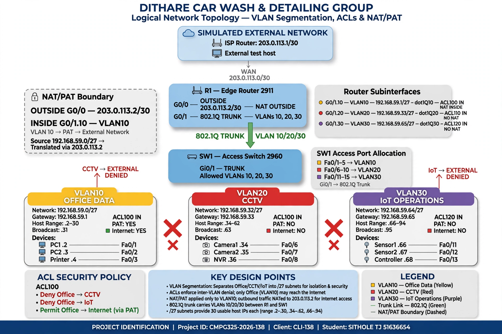

# Logical Topology

**Project ID:** CMPG325-2026-138
**Client ID:** CLI-138
**Student:** SITHOLE, TJ (51636654)
**Organisation:** Dithare Car Wash & Detailing Group
**Location:** Potchefstroom
**Industry:** Automotive
**Addressing Block:** `192.168.59.0/24`

---

## 1. Purpose

This document describes the **logical topology** for the Dithare Car Wash & Detailing Group network.

The logical design defines:

* VLAN segmentation
* IP subnet allocation
* Inter-VLAN routing
* Router-on-a-stick implementation
* Traffic segmentation and access control
* NAT/PAT for authorised external connectivity
* The relationship between the logical and physical topology

The design is based on the client requirements, the CCTV segmentation constraint, and the CR12 requirement for an isolated IoT/Operations segment.

---

## 2. Logical Network Overview

The network uses a **router-on-a-stick** architecture consisting of one edge router and one access switch.

The logical structure is:

```text
                 Simulated External Network
                           |
                           |
                    R1 G0/0 - WAN
                  NAT Outside
                           |
                         R1
                           |
                    G0/1  Trunk
                    802.1Q
                           |
                         SW1
                  _________|_________
                 |         |         |
              VLAN 10   VLAN 20   VLAN 30
               Office      CCTV    IoT/Operations
```

### Main Design Principles

1. SW1 provides Layer 2 VLAN segmentation.
2. R1 provides Layer 3 routing between the VLANs.
3. A single 802.1Q trunk carries VLAN 10, VLAN 20 and VLAN 30 between SW1 and R1.
4. Each VLAN has a dedicated `/27` subnet.
5. Office traffic is permitted to access the simulated external network through NAT/PAT.
6. CCTV and IoT/Operations traffic is isolated and does not receive external Internet access.
7. ACLs are used as the Layer 3 enforcement mechanism for the required segmentation.

---

## 3. VLAN Architecture

The internal `192.168.59.0/24` address block is divided into `/27` subnets.

| VLAN ID | Name             | Network            | Default Gateway | Purpose                                         |
| ------: | ---------------- | ------------------ | --------------- | ----------------------------------------------- |
|      10 | Office Data      | `192.168.59.0/27`  | `192.168.59.1`  | Staff PCs, printer, administration and bookings |
|      20 | CCTV             | `192.168.59.32/27` | `192.168.59.33` | Security cameras and NVR                        |
|      30 | IoT / Operations | `192.168.59.64/27` | `192.168.59.65` | Operational sensors and IoT controller          |

### VLAN 10 — Office Data

Office Data contains the representative business devices:

* PC 1 — `192.168.59.2`
* PC 2 — `192.168.59.3`
* Printer — `192.168.59.4`

The Office VLAN requires access to the simulated external network.

### VLAN 20 — CCTV

CCTV contains:

* Camera 1 — `192.168.59.34`
* Camera 2 — `192.168.59.35`
* NVR — `192.168.59.36`

The CCTV segment is isolated from Office and IoT/Operations traffic and does not require external Internet access.

### VLAN 30 — IoT / Operations

IoT/Operations contains:

* Sensor 1 — `192.168.59.66`
* Sensor 2 — `192.168.59.67`
* IoT Controller — `192.168.59.68`

The IoT/Operations segment is isolated from the other VLANs and does not require external Internet access.

### Management

No dedicated Management VLAN is included. This is consistent with the project scope and client requirements.

---

## 4. IP Addressing Plan

| VLAN | Network Address | Subnet Mask       | Default Gateway | Usable Host Range (End Devices) | Broadcast       |
| ---: | --------------- | ----------------- | --------------- | ------------------------------- | --------------- |
|   10 | `192.168.59.0`  | `255.255.255.224` | `192.168.59.1`  | `192.168.59.2 – 192.168.59.30`  | `192.168.59.31` |
|   20 | `192.168.59.32` | `255.255.255.224` | `192.168.59.33` | `192.168.59.34 – 192.168.59.62` | `192.168.59.63` |
|   30 | `192.168.59.64` | `255.255.255.224` | `192.168.59.65` | `192.168.59.66 – 192.168.59.94` | `192.168.59.95` |

Each `/27` subnet provides **30 usable host addresses**. The default gateway is an assigned router address and is therefore excluded from the end-device host range.

The remaining address space beginning at `192.168.59.96` remains available for future expansion.

The complete addressing scheme should be maintained in:

`04_IP_Addressing/IP_Addressing_Plan.md`

---

## 5. Inter-VLAN Routing

R1 performs inter-VLAN routing using **router-on-a-stick**.

The physical `GigabitEthernet0/1` interface on R1 connects to SW1 through an 802.1Q trunk.

The interface itself does not have an IP address. Instead, logical subinterfaces are created for each VLAN.

| R1 Subinterface | VLAN | IP Address         | Purpose                        |
| --------------- | ---: | ------------------ | ------------------------------ |
| `G0/1.10`       |   10 | `192.168.59.1/27`  | Office default gateway         |
| `G0/1.20`       |   20 | `192.168.59.33/27` | CCTV default gateway           |
| `G0/1.30`       |   30 | `192.168.59.65/27` | IoT/Operations default gateway |

Each subinterface uses IEEE 802.1Q encapsulation.

```text
G0/1.10 → dot1Q 10 → 192.168.59.1
G0/1.20 → dot1Q 20 → 192.168.59.33
G0/1.30 → dot1Q 30 → 192.168.59.65
```

R1 therefore has a directly connected route for each internal VLAN.

No dynamic routing protocol is required because all internal networks are directly connected to R1.

---

## 6. Switch VLAN and Trunk Design

SW1 provides Layer 2 connectivity.

The following VLANs are created:

```text
VLAN 10 — Office Data
VLAN 20 — CCTV
VLAN 30 — IoT / Operations
```

The SW1-to-R1 uplink is configured as an 802.1Q trunk.

| Device | Interface | Mode           | VLANs      |
| ------ | --------- | -------------- | ---------- |
| SW1    | `Gi0/1`   | Trunk          | 10, 20, 30 |
| R1     | `Gi0/1`   | Trunk endpoint | 10, 20, 30 |

Representative access-port allocation:

| SW1 Ports       | VLAN | Segment          |
| --------------- | ---: | ---------------- |
| `Fa0/1–Fa0/5`   |   10 | Office Data      |
| `Fa0/6–Fa0/10`  |   20 | CCTV             |
| `Fa0/11–Fa0/15` |   30 | IoT / Operations |

The exact port assignments must remain consistent with the physical topology and Packet Tracer implementation.

---

## 7. Traffic Segmentation and ACL Design

VLANs provide Layer 2 separation, but R1 would normally route traffic between directly connected VLANs.

Therefore, **ACLs are used as the Layer 3 enforcement mechanism** to prevent unauthorised inter-VLAN communication.

The objective is to ensure that:

* Office cannot initiate traffic toward CCTV.
* Office cannot initiate traffic toward IoT/Operations.
* CCTV cannot reach Office, IoT/Operations or the external network.
* IoT/Operations cannot reach Office, CCTV or the external network.
* Devices within the same VLAN can communicate normally where required.

### 7.1 Intended Traffic Rules

| Source         | Destination      | Action    | Reason                                   |
| -------------- | ---------------- | --------- | ---------------------------------------- |
| Office         | External Network | **ALLOW** | Required for business operations         |
| Office         | CCTV             | **DENY**  | CCTV segmentation requirement            |
| Office         | IoT/Operations   | **DENY**  | IoT isolation requirement                |
| CCTV           | Office           | **DENY**  | Protect Office network from CCTV segment |
| CCTV           | IoT/Operations   | **DENY**  | No business requirement                  |
| CCTV           | External Network | **DENY**  | CCTV does not require Internet           |
| IoT/Operations | Office           | **DENY**  | Protect Office network                   |
| IoT/Operations | CCTV             | **DENY**  | No business requirement                  |
| IoT/Operations | External Network | **DENY**  | IoT does not require Internet            |
| CCTV           | Same VLAN        | **ALLOW** | Required for CCTV/NVR operation          |
| IoT/Operations | Same VLAN        | **ALLOW** | Required for sensor/controller operation |

### 7.2 ACL Enforcement Design

The intended ACL placement is:

| ACL     | Applied Inbound On | Protected Segment | Primary Function                                                                                                  |
| ------- | ------------------ | ----------------- | ----------------------------------------------------------------------------------------------------------------- |
| ACL 100 | `G0/1.10`          | Office            | Prevent Office from initiating traffic toward CCTV and IoT/Operations while permitting authorised external access |
| ACL 110 | `G0/1.20`          | CCTV              | Prevent CCTV traffic from reaching Office, IoT/Operations or the external network                                 |
| ACL 120 | `G0/1.30`          | IoT/Operations    | Prevent IoT/Operations traffic from reaching Office, CCTV or the external network                                 |

**Enforcement:** ACL 100 is applied inbound on `G0/1.10`, ACL 110 inbound on `G0/1.20`, and ACL 120 inbound on `G0/1.30`. This provides a defined Layer 3 enforcement point for each VLAN and ensures that the segmentation policy is implemented consistently in both traffic directions.

All three subinterfaces require explicit ACL enforcement because each VLAN is a possible source of routed traffic. Applying ACLs only to CCTV and IoT would leave Office-originated traffic controlled while failing to provide an equivalent source-side enforcement point for traffic originating from those other segments. The three-ACL design therefore makes the security policy explicit, provides a source-side Layer 3 enforcement point for each VLAN, and makes the configuration easier to verify during implementation.

The exact Cisco IOS ACL commands will be implemented and verified during the Packet Tracer configuration stage.

---

## 8. NAT/PAT Design

NAT is implemented on R1 as the boundary between the private internal network and the simulated external network.

Only the Office VLAN requires external connectivity.

### NAT Roles

| Interface    | NAT Role         | Purpose                                      |
| ------------ | ---------------- | -------------------------------------------- |
| `R1 G0/0`    | Outside          | Connection to simulated external/ISP network |
| `R1 G0/1.10` | Inside           | Office VLAN                                  |
| `R1 G0/1.20` | Not used for NAT | CCTV has no external access                  |
| `R1 G0/1.30` | Not used for NAT | IoT/Operations has no external access        |

PAT/NAT overload allows multiple Office devices to share the outside interface address.

The NAT matching ACL permits only the Office subnet:

```text
access-list 10 permit 192.168.59.0 0.0.0.31
ip nat inside source list 10 interface GigabitEthernet0/0 overload
```

**ACL numbering clarification:** `ACL 10` is reserved for the NAT source-matching rule and is separate from the segmentation ACLs `ACL 100`, `ACL 110` and `ACL 120`. These ACLs serve different purposes and therefore use different numbers to avoid configuration ambiguity.

The design deliberately excludes CCTV and IoT/Operations from NAT.

This ensures that NAT is applied only to traffic that has a legitimate requirement for external connectivity.

### 8.1 NAT Verification

During Packet Tracer implementation, NAT/PAT will be verified using:

```text
show ip nat translations
show ip nat statistics
```

Successful Office traffic to the simulated external network should produce a NAT translation. CCTV and IoT/Operations traffic should not produce translations because those networks are not authorised for external connectivity.

---

## 9. Simulated External Network

A small external network is used in Packet Tracer to demonstrate NAT/PAT.

The WAN connection uses the documentation address block `203.0.113.0/30`.

| Device     | Interface | Address          | Purpose                    |
| ---------- | --------- | ---------------- | -------------------------- |
| ISP Router | `G0/0`    | `203.0.113.1/30` | Simulated upstream gateway |
| R1         | `G0/0`    | `203.0.113.2/30` | NAT outside interface      |

The simulated external network may contain a test server on an appropriate upstream subnet.

The exact external server addressing will be finalised during Packet Tracer implementation so that it is consistent with the ISP-side topology.

R1 will use the ISP router as its default next hop:

```text
ip route 0.0.0.0 0.0.0.0 203.0.113.1
```

This default route is used for traffic leaving the internal network.

---

## 10. Logical Traffic Flow

### 10.1 Office to External Network

```text
Office PC
192.168.59.2
      |
      v
SW1 — VLAN 10
      |
802.1Q Trunk
      |
      v
R1 G0/1.10
192.168.59.1
      |
   ACL Check
      |
    NAT/PAT
      |
      v
R1 G0/0
203.0.113.2
      |
      v
Simulated ISP
```

The Office source address is translated by PAT before the packet leaves R1.

### 10.2 Office to CCTV

```text
Office PC → VLAN 10 → SW1 → 802.1Q Trunk → R1
                                                |
                                            ACL Check
                                                |
                                                X
                                             DENIED
```

Office devices are prevented from initiating communication with the CCTV subnet.

### 10.3 CCTV to Office

```text
CCTV Camera → VLAN 20 → SW1 → 802.1Q Trunk → R1 G0/1.20
                                                    |
                                                ACL Check
                                                    |
                                                    X
                                                 DENIED
```

### 10.4 IoT/Operations to External Network

```text
IoT Sensor → VLAN 30 → SW1 → 802.1Q Trunk → R1 G0/1.30
                                                    |
                                                ACL Check
                                                    |
                                                    X
                                                 DENIED
```

IoT/Operations traffic is not translated by NAT and is denied external access.

---

## 11. Logical Topology Diagram



The SVG version of the diagram is retained as the editable source:

[logical_topology.svg](logical_topology.svg)

The diagram shows R1, the NAT boundary, 802.1Q trunk, three VLANs with addressing, ACL policy and denied inter-segment / Internet paths.

---

## 12. Design Rationale

### 12.1 VLAN Segmentation

VLANs were selected to provide logical separation between different categories of network devices.

This reduces unnecessary Layer 2 communication and provides a foundation for enforcing security policies at Layer 3.

### 12.2 Router-on-a-Stick

Router-on-a-stick was selected because the physical design uses one router and one access switch.

It provides inter-VLAN routing without requiring an additional Layer 3 switch or additional routing hardware.

This is appropriate for the size and scope of the client network.

### 12.3 ACL-Based Segmentation

ACLs are used to control traffic that would otherwise be routed between directly connected VLANs.

ACLs are applied inbound on all three VLAN subinterfaces because each VLAN can originate routed traffic. This provides a clear source-side enforcement point for Office, CCTV and IoT/Operations traffic and prevents the security policy from depending on a single-direction filter.

### 12.4 Office-Only NAT

Only Office devices require external connectivity.

Restricting NAT to VLAN 10 avoids unnecessarily providing an external path for CCTV and IoT/Operations devices.

PAT also allows multiple Office devices to share a single external interface address.

### 12.5 /27 Subnetting

A `/27` provides 30 usable addresses per VLAN.

This is sufficient for the representative devices while leaving additional address space within the `/24` block for future expansion.

---

## 13. Relationship to Physical Topology

| Physical Element       | Logical Role                   |
| ---------------------- | ------------------------------ |
| R1 `G0/0`              | WAN/NAT outside interface      |
| R1 `G0/1`              | 802.1Q trunk toward SW1        |
| R1 `G0/1.10`           | Office default gateway         |
| R1 `G0/1.20`           | CCTV default gateway           |
| R1 `G0/1.30`           | IoT/Operations default gateway |
| SW1 `Gi0/1`            | Trunk toward R1                |
| SW1 access ports       | Assigned to VLAN 10, 20 or 30  |
| Office devices         | VLAN 10                        |
| CCTV devices           | VLAN 20                        |
| IoT/Operations devices | VLAN 30                        |

The logical topology must remain consistent with the physical topology documented in `02_Physical_Topology/physical_topology.md`.

---

## 14. Packet Tracer Implementation Notes

The logical design will be implemented using:

* **Router:** Cisco 2911 or equivalent
* **Switch:** Cisco 2960 or equivalent
* **802.1Q trunk:** R1 G0/1 ↔ SW1 Gi0/1
* **VLANs:** 10, 20 and 30
* **Router subinterfaces:** G0/1.10, G0/1.20 and G0/1.30
* **NAT/PAT:** Office VLAN only
* **ACLs:** Used to enforce VLAN isolation
* **Default route:** R1 toward the simulated ISP

Configuration should be added to the Packet Tracer file only after the base topology and addressing have been verified.

---

## 15. Verification Plan

The completed implementation should be verified against the logical design.

The main verification areas are:

* VLAN creation and access-port assignment
* 802.1Q trunk operation
* Router subinterface status and addressing
* Default gateway connectivity
* Same-VLAN communication
* Inter-VLAN segmentation
* Office-only external connectivity
* NAT/PAT operation
* ACL enforcement and hit counters

Detailed testing procedures, command output and evidence screenshots should be documented during the Packet Tracer implementation and testing stage.

---

## 16. Requirements Traceability

| Requirement                      | Logical Design Response                                                    |
| -------------------------------- | -------------------------------------------------------------------------- |
| CCTV segmentation                | VLAN 20 separates CCTV at Layer 2; ACLs restrict routed access             |
| IoT isolation / CR12             | VLAN 30 provides a dedicated isolated segment; ACLs restrict routed access |
| Office external access           | VLAN 10 is permitted to reach the simulated external network               |
| NAT challenge                    | PAT/NAT overload is implemented on R1 for the Office subnet                |
| Assigned `192.168.59.0/24` block | Address space is subnetted into `/27` VLAN networks                        |
| Single-site scale                | Router-on-a-stick uses one edge router and one access switch               |
| No dedicated management VLAN     | Management remains outside the project VLAN scope                          |

---

## 17. Related Project Documents

* [`../01_Client_Requirements/01-client-requirements.md`](../01_Client_Requirements/01-client-requirements.md)
* [`../02_Physical_Topology/physical_topology.md`](../02_Physical_Topology/physical_topology.md)
* [`../02_Physical_Topology/physical_topology.svg`](../02_Physical_Topology/physical_topology.svg)
* [`../04_IP_Addressing/IP_Addressing_Plan.md`](../04_IP_Addressing/IP_Addressing_Plan.md)
* [`logical_topology.svg`](logical_topology.svg)

---

## 18. Document Control

| Version | Date       | Author      | Changes                                                                                                                 |
| ------- | ---------- | ----------- | ----------------------------------------------------------------------------------------------------------------------- |
| 1.0     | 2026-08-20 | SITHOLE, TJ | Initial logical topology documentation for Milestone 1                                                                  |
| 1.1     | 2026-08-20 | SITHOLE, TJ | Corrected NAT, routing and ACL design; aligned logical topology with project requirements                               |
| 1.2     | 2026-08-22 | SITHOLE, TJ | Finalised IP host ranges, ACL enforcement rationale, document references, verification scope and Milestone 1 formatting |
| 1.3     | 2026-08-24 | SITHOLE, TJ | Embedded logical diagram; corrected related-document paths                                                              |
| 1.4     | 2026-08-27 | SITHOLE, TJ | Corrected physical filename; design-constraint wording in traceability                                                  |
| 1.5     | 2026-08-28 | SITHOLE, TJ | Changed Markdown diagram preview to PNG, retained SVG as editable source, and clarified NAT ACL numbering               |
